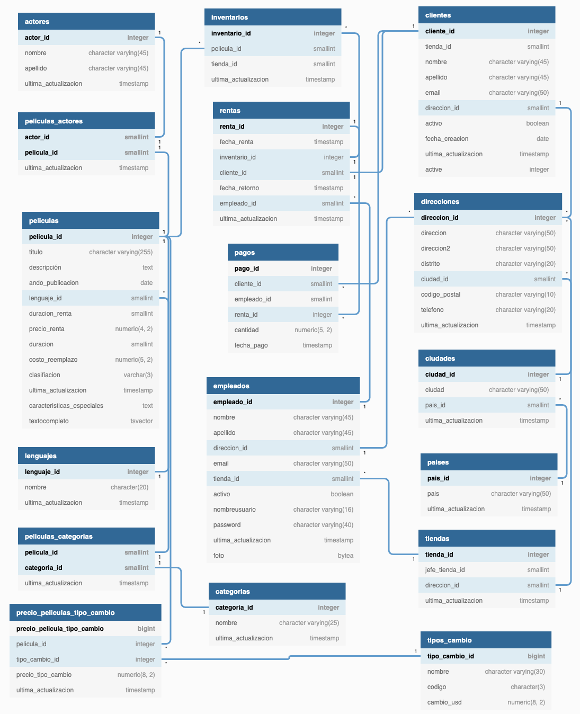

# Proyecto de peliculas aplicando Data Science con PostgreSQL

## Requerimientos

* PostgreSQL 12 o superior
* Pg Admin

## ¿Cómo iniciar?

* Crea la base de datos Peliculas
* Selecciona Tools/Restore para restaurar la base de datos

  

* Debes ver la siguiente estructura de tablas

  

* Diagrama ER

  

## Consultas a la base de datos

Los querys se encuentran dentro del presente repositorio y realizan lo siguiente

1. Agregaciones de datos
2. Manipulación de datos con objetos JSON
3. Presentación de la información
4. Common Table Expressions
5. Window functions

## Visualización de datos en Tableau

Es importante que después de preparar los querys la información pueda contar una historia

  

## Para ver más conceptos avanzados

https://github.com/eocode/Love-Data-with-Python-SQL-R-Scala/tree/master/learn/DataScience/PostgreSQL

# Liciencia

 GNU GENERAL PUBLIC LICENSE Version 3

# Cómo contribuir

Enviame un pull request o contactame en redes sociales como **eocode**